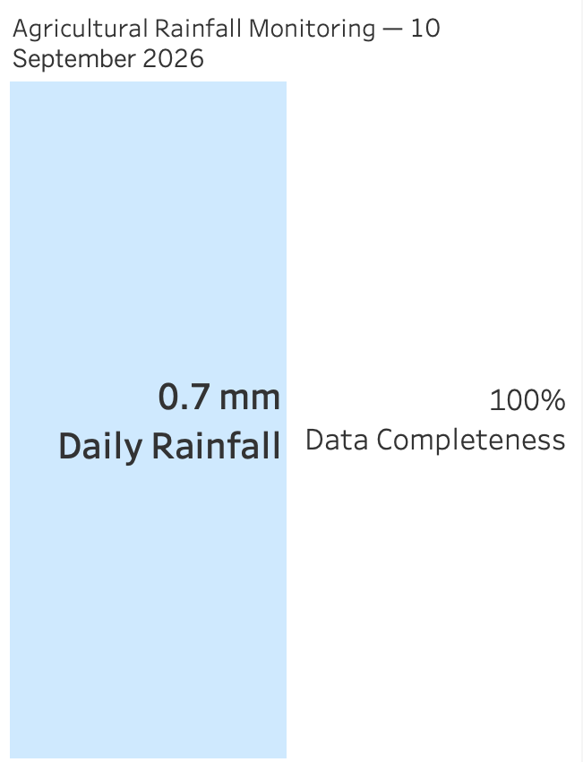

# Agricultural Rainfall Monitoring

A Python and DuckDB data pipeline for processing Environment Agency rainfall data for agricultural monitoring.

The project collects rainfall readings from the Environment Agency Real Time flood-monitoring API, preserves the raw response, transforms the data into a relational model, and produces a daily rainfall summary for visualisation in Tableau.

## About Me

My interest in data engineering has grown through working on my own projects. The more I’ve explored the field, the more I’ve felt that the work suits the way I naturally think. I enjoy breaking complex problems down, understanding how different parts of a system fit together, and looking for solutions that are both practical and elegant. I’m naturally driven to study and learn new things, and I’ve found the process of encountering problems, working through them and coming out more capable on the other side genuinely rewarding.

I applied to The Information Lab because of the opportunity to be trained across a broad data engineering stack and then put those skills into practice working with real clients. The combination of hands-on training, coaching and experience working alongside data engineers on real projects is particularly attractive to me.

I think one of my strengths is how I respond when things aren’t working. I don’t tend to get discouraged by setbacks; my instinct is to work out what I can do next, ask questions when I need to, and keep going until I understand the problem. I’m open to feedback and enjoy being challenged, which I think would make me a good fit for the coaching environment at The Data School.

## Use Case

The pipeline is designed around a simple agricultural use case: helping a farm manager or grower monitor recent rainfall near agricultural land while also showing whether the underlying data is complete.

Rainfall totals alone can be misleading when readings are missing, so the pipeline produces both:

- daily rainfall in millimetres
- measurement completeness for the day

## Pipeline Architecture

```text
Environment Agency API
        |
        v
Bronze: readings_raw.json
        |
        v
Silver: DuckDB
        |
        |-- stations
        |-- measures
        |-- rainfall_readings
        |
        v
Gold: daily_rainfall_summary
        |
        v
daily_rainfall_summary.csv
        |
        v
Tableau dashboard
```

### Bronze

`fetch_rainfall.py` requests rainfall readings from the Environment Agency API and stores the raw response unchanged in `readings_raw.json`.

The script also performs basic source-data validation by checking:

- HTTP request success
- expected number of readings
- unique reading count
- 15-minute reading intervals
- daily completeness

Preserving the raw response means the downstream transformation can be rerun without requesting the source data again.

### Silver

`load_readings.py` loads the Bronze data into DuckDB using three related tables:

```text
stations
   |
   | 1:M
   v
measures
   |
   | 1:M
   v
rainfall_readings
```

Station, measure and reading data are stored separately to avoid repeatedly storing the same metadata and to preserve the relationships between the source entities.

Primary and foreign keys enforce these relationships.

The load uses `ON CONFLICT DO NOTHING` on entity IDs so that rerunning the script does not create duplicate records.

### Gold

`build_gold.py` creates `daily_rainfall_summary`, containing:

- date
- rainfall measure
- total daily rainfall
- actual reading count
- expected reading count
- completeness percentage

Daily aggregation uses UTC because the source readings are timestamped in UTC. This prevents local timezone conversion from splitting one source day across two dates.

The Gold table is exported to `daily_rainfall_summary.csv` for use in Tableau.

## Dashboard

The Tableau dashboard presents two simple operational metrics:

- daily rainfall
- data completeness

The packaged Tableau workbook is available at:

`dashboard/agricultural_rainfall_monitoring.twbx`

### Example Dashboard




## Running the Pipeline

Install the required Python packages:

```bash
pip install -r requirements.txt
```

Then run the pipeline scripts in order:

```bash
python fetch_rainfall.py
python load_readings.py
python build_gold.py
```

This produces the flow:

```text
API -> raw JSON -> DuckDB -> daily summary -> CSV
```

## Current Scope

The current prototype processes one selected Environment Agency rainfall measure and date.

The data model can represent multiple stations and measures, but ingestion is not yet automated across multiple locations.

The current measure reports at 15-minute intervals, giving an expected 96 readings per UTC day.

## Future Improvements

Possible next steps include:

- parameterising ingestion across multiple stations, measures and dates
- deriving expected reading counts from each measure's reporting period
- adding ingestion metadata such as retrieval time and source URL
- handling revised readings rather than only ignoring duplicate IDs
- expanding missing-value validation
- handling API pagination for larger requests
- adding automated tests
- supporting rainfall totals and completeness over user-defined time windows, making the data more useful for planning agricultural interventions and historical or seasonal comparisons

## Data Source

This project uses Environment Agency rainfall data from the Real Time flood-monitoring API (Beta).

The API does not require authentication. The current request retrieves a single day of 15-minute readings using a limit of 100 records, which is sufficient for the expected 96 readings for the selected measure. Larger requests would require pagination rather than relying on a single response.

The current pipeline makes only a small number of API requests. For larger-scale ingestion, request frequency and any published rate limits or usage guidance would need to be checked and respected.

Environment Agency data is used under the Open Government Licence.


## Use of AI

I used AI as a learning and development aid throughout the project. This included:

- initial brainstorming and research to help select an appropriate project and data source
- breaking down unfamiliar data-engineering concepts and testing my understanding through questions and quizzes
- debugging support when investigating problems in the pipeline
- coaching on engineering decisions and possible improvements
- reviewing documentation and helping me communicate the project clearly

I used AI interactively rather than treating generated output as a finished solution. I made the project and engineering decisions myself, using AI to help me explore options, understand unfamiliar concepts, debug problems and challenge my thinking.